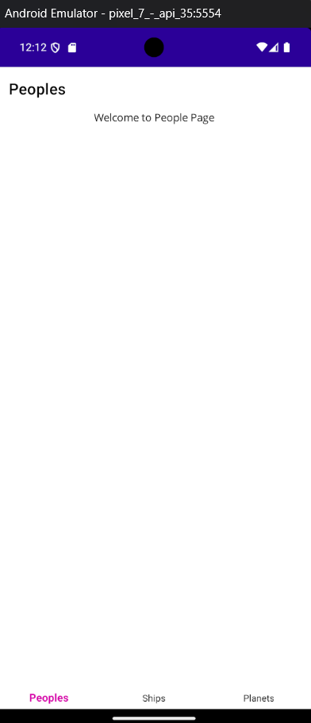

# StarWars App - DEMO

Este repositorio muestra una aplicación desarrollada en .NET MAUI donde se consume la API [SWAPI](https://swapi.py4e.com/) en donde se muestra solamente un listado de [/people](https://swapi.py4e.com/api/people/) y otro de [/startships](https://swapi.py4e.com/api/starships/) provenientes de la API antes mencionada en cada Tab. Por ende, este ejemplo tiene la finalidad el servir de guia para que los desarrolladores nuevos aprendan con un ejemplo sencillo.

## ScreenShots

